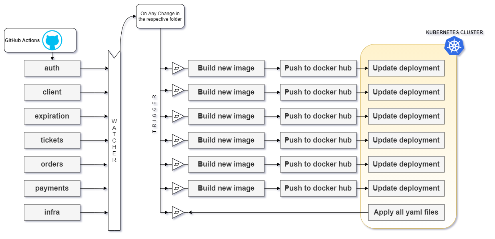

## Kubernetes **Secret Service** commands need to run manually in dev but required a config file for prod deployment **_[Required research]_**

> **_kubectl create secret generic jwt-secret --from-literal=JWT_KEY=sdfd23kdwopewqiukc_**

## How to get secrets

> **_kubectl get secrets_**

## For Prod Initial Setup

> 1. Run the Secret Keys in Remote Kubernetes Cluster Console: JWT_KEY(Any), STRIPE_KEY(From Stripe Account)
> 2. Install Ingress-nginx deployment file
>    - Download [Link](https://raw.githubusercontent.com/kubernetes/ingress-nginx/controller-v1.0.0/deploy/static/provider/cloud/deploy.yaml)
>    - Refer the bug: [Udemy](https://www.udemy.com/course/microservices-with-node-js-and-react/learn/lecture/27616972#overview)

## Continuous Deployment WorkFlow

